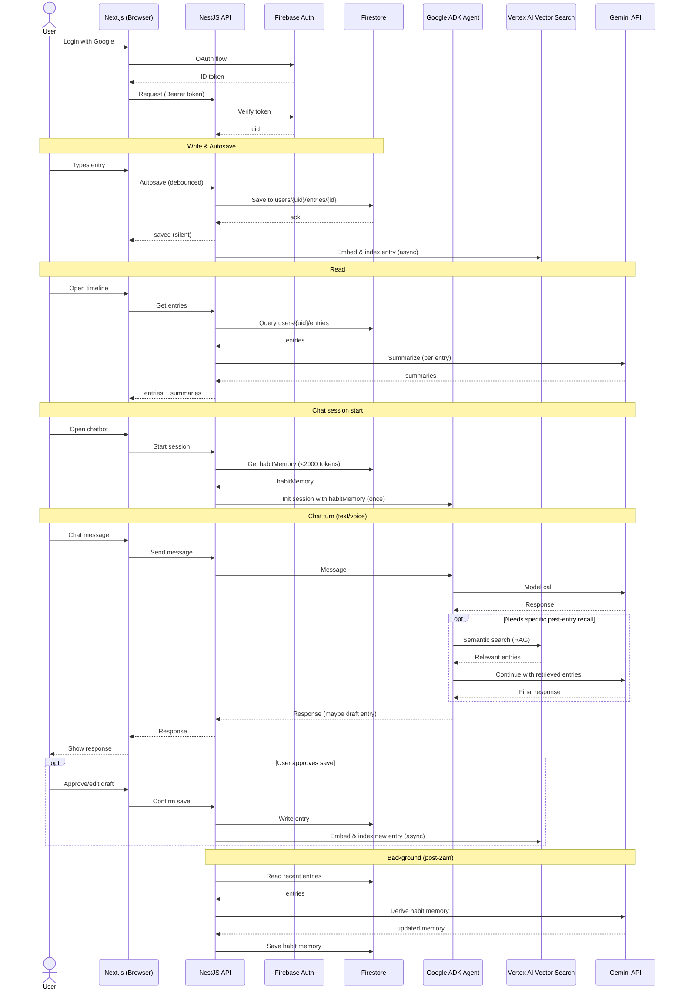
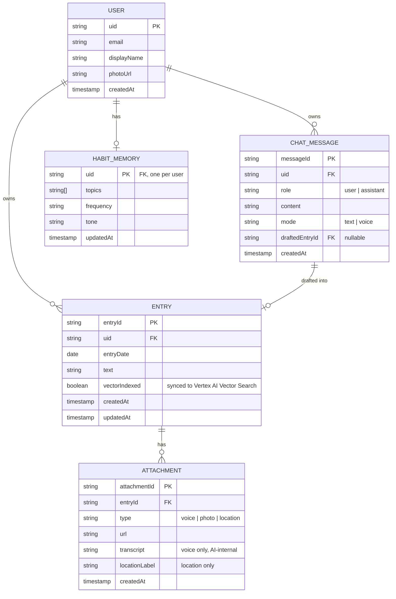

# Architecture

## Tech Stack

### Language

- **TypeScript** — base language across the entire stack (frontend +
  backend), enabling shared types/DTOs and reducing drift between layers.

### Frontend

- **Next.js** — web app framework. Authenticated, mostly dynamic content;
  SSR/SSG not a primary concern.

### Backend / API

- **NestJS** — API framework. Chosen specifically because its
  module/controller/service/DI structure naturally supports the layered
  architecture and SOLID requirements below.

### Core Infrastructure (Google Cloud)

- **Firebase Authentication** — handles the Google OAuth login flow end to
  end. Backend verifies tokens via the Firebase Admin SDK.
- **Firestore** — primary data store, **user-isolated**. Structured as
  subcollections per user (e.g. `users/{uid}/entries/{entryId}`) rather than
  a top-level collection with manual `uid` filtering — cleaner isolation,
  less error-prone than rule-based filtering alone.
- **Gemini API** — powers all AI features (chat, summary, context
  extraction, habit memory). Native fit with multi-modal input (text, voice
  transcript, image) matching the app's attachment types.
- **Google ADK (Agent Development Kit)** — builds the chatbot's agent logic
  on top of Gemini (conversation flow, tool-calling for journal context
  lookup / entry-save actions, real-time voice conversation). Sits inside
  the AI Provider layer (behind the `AIProvider` interface) — business
  logic still only depends on the interface, not on ADK directly.
- **Vertex AI Vector Search (RAG)** — semantic recall over the user's
  journal entries (e.g. "what was I stressed about last month?"). Entries
  are embedded and indexed (per-user isolated) so the chatbot can retrieve
  relevant past entries on demand via an ADK tool-call, rather than pulling
  raw entry lists into every prompt.
- **Google Cloud Secret Manager** — all secrets (Gemini API key, etc.) are
  fetched at runtime/boot, never stored in code or env files.
- **Hosting** — Google Cloud only. Exact topology (e.g. Cloud Run for both
  Next.js and NestJS, or Next.js on Firebase Hosting + Cloud Run for the
  API) to be decided at deployment planning time — not yet finalized.

---

## Design Decisions

### Layered architecture, not hexagonal

**Principle: business logic (higher-level) must not know about APIs,
database, or client details (lower-level).** Achieved via a lightweight
layered architecture — not full hexagonal/ports-and-adapters, which was
considered and deliberately skipped as unnecessary overhead for this app's
scope. Three layers:

1. **Controller** (NestJS) — HTTP layer only, request/response, DTO
   validation. Calls into the service layer. No business logic.
2. **Service** — where business logic lives (entry rules, habit-memory
   logic, chatbot's context-draft-approval flow). Depends on **interfaces**
   (`EntryRepository`, `AIProvider`, `VectorSearchProvider`,
   `HabitMemoryStore`), never on concrete implementations directly.
3. **Repository / Provider** — concrete implementations
   (`FirestoreEntryRepository`, `GeminiAIProvider`, etc.) behind those
   interfaces. Injected via NestJS's DI container, swappable without
   touching business logic.

### SOLID in practice

- **S** — each class has one reason to change (`EntryService` is separate
  from `FirestoreEntryRepository`, separate from `GeminiSummaryProvider`).
- **O** — swapping an AI provider later means adding a new adapter class,
  zero change to business logic.
- **L** — any repository/provider implementation is substitutable behind
  its interface.
- **I** — small, focused interfaces rather than one catch-all interface.
- **D** — services and controllers depend on abstractions; concrete wiring
  is handled by NestJS's DI container.

### Chat context strategy — two separate mechanisms

- **Habit memory** — pre-computed (post-2am background job), capped at
  **under 2000 tokens**, injected **once at chat session start**. Shapes
  tone and judgment (e.g. what's "worth" offering to save) — ambient
  awareness, not factual recall. Not re-fetched per message.
- **RAG (journal entry recall)** — not injected upfront. Retrieved on
  demand, mid-conversation, via an ADK tool-call to Vertex AI Vector
  Search, only when the user's question requires recalling specific past
  entries.

This split keeps "who is this user" (static per session) separate from
"what did this user write" (dynamic per question), avoiding a full-corpus
scan or dump on every chat turn.

### Habit memory update timing

Habit memory is not updated live. It refreshes via a **scheduled background
job, after 2am** (when the user is asleep), processing recent journal
activity silently — no loading state, no notification. Keeps AI behavior
stable within a day and avoids heavier processing during active use.

### Firestore schema — normalized despite being NoSQL

Even on a document DB, data is split into separate collections
(entries, attachments, chat messages, habit memory) referenced by
`uid`/`entryId` rather than duplicated/nested inline, avoiding update
anomalies and keeping each document focused — a 3NF-style discipline
applied deliberately, not a default Firestore behavior.

### Vector index lives outside Firestore

RAG embeddings are stored in Vertex AI Vector Search, not Firestore —
Firestore isn't built for similarity search at scale. Firestore only
tracks a `vectorIndexed` flag per entry to know sync status.

---

## Testing

Both **unit** and **integration** testing are mandatory.

- **Unit tests** — target the service layer in isolation, mocking the
  repository/provider interfaces (no real Firestore/Gemini calls). Fast,
  pure business-logic verification.
- **Integration tests** — verify actual wiring: Controller → Service →
  Repository, using the **Firebase Local Emulator Suite** for Firestore and
  Auth. Gemini/ADK calls are mocked/stubbed in automated tests (real calls
  are slow, costly, flaky) — real verification happens manually or in
  staging.
- **Framework** — Jest (NestJS's default).

---

## Diagrams

### Sequence Diagram

### Class Diagram (Business Logic Layer Only)

```mermaid
classDiagram
    class EntryService {
        -repo: EntryRepository
        -aiProvider: AIProvider
        -vectorSearch: VectorSearchProvider
        +createEntry(uid, text, attachments) Entry
        +editEntry(uid, entryId, text) Entry
        +getTimeline(uid) EntrySummary[]
    }

    class ChatService {
        -repo: EntryRepository
        -habitStore: HabitMemoryStore
        -aiProvider: AIProvider
        +startSession(uid) ChatSession
        +sendMessage(uid, message, mode) ChatResponse
        +draftEntryFromContext(uid, context) EntryDraft
        +confirmDraftSave(uid, draft, target) Entry
    }

    class HabitMemoryService {
        -repo: EntryRepository
        -habitStore: HabitMemoryStore
        -aiProvider: AIProvider
        +refreshMemory(uid) HabitMemory
    }

    class EntryRepository {
        <<interface>>
        +save(uid, entry) Entry
        +findById(uid, entryId) Entry
        +findByDate(uid, date) Entry
        +listByUser(uid) Entry[]
    }

    class HabitMemoryStore {
        <<interface>>
        +get(uid) HabitMemory
        +save(uid, memory) void
    }

    class AIProvider {
        <<interface>>
        +summarize(text) string
        +chat(uid, message, session) ChatResponse
        +extractContext(conversation) EntryDraft
        +deriveHabitMemory(entries) HabitMemory
    }

    class VectorSearchProvider {
        <<interface>>
        +indexEntry(uid, entry) void
        +semanticSearch(uid, query) Entry[]
    }

    class Entry {
        +id: string
        +uid: string
        +date: Date
        +text: string
        +voiceUrl?: string
        +photoUrls?: string[]
        +location?: string
    }

    class EntrySummary {
        +id: string
        +date: Date
        +preview: string
    }

    class EntryDraft {
        +text: string
        +sourceContext: string
    }

    class HabitMemory {
        +uid: string
        +topics: string[]
        +frequency: string
        +tone: string
        +updatedAt: Date
    }

    class ChatSession {
        +uid: string
        +habitMemory: HabitMemory
        +startedAt: Date
    }

    EntryService --> EntryRepository
    EntryService --> AIProvider
    EntryService --> VectorSearchProvider
    ChatService --> EntryRepository
    ChatService --> HabitMemoryStore
    ChatService --> AIProvider
    HabitMemoryService --> EntryRepository
    HabitMemoryService --> HabitMemoryStore
    HabitMemoryService --> AIProvider
    EntryService ..> Entry
    EntryService ..> EntrySummary
    ChatService ..> EntryDraft
    ChatService ..> ChatSession
    HabitMemoryService ..> HabitMemory
```

Note: RAG's semantic search/indexing is called by ADK directly as a tool at
the infra layer (per sequence diagram above), not routed through
`ChatService` — the agent owns that tool-call, not the business logic
layer. `EntryService` depends on `VectorSearchProvider` only for the async
index-on-save step.

### Schema Diagram (Firestore, Normalized)

Firestore paths:
- `users/{uid}`
- `users/{uid}/entries/{entryId}`
- `users/{uid}/entries/{entryId}/attachments/{attachmentId}`
- `users/{uid}/chatMessages/{messageId}`
- `users/{uid}/habitMemory` (single doc)

Vector index (Vertex AI Vector Search) is a separate store outside
Firestore, referenced by `entryId` + `uid` for per-user isolation — not a
Firestore collection, so not part of the ERD above.

---

## Explicitly Not Used

- No hexagonal / ports-and-adapters architecture — layered separation above
  is sufficient without the extra structural overhead.
