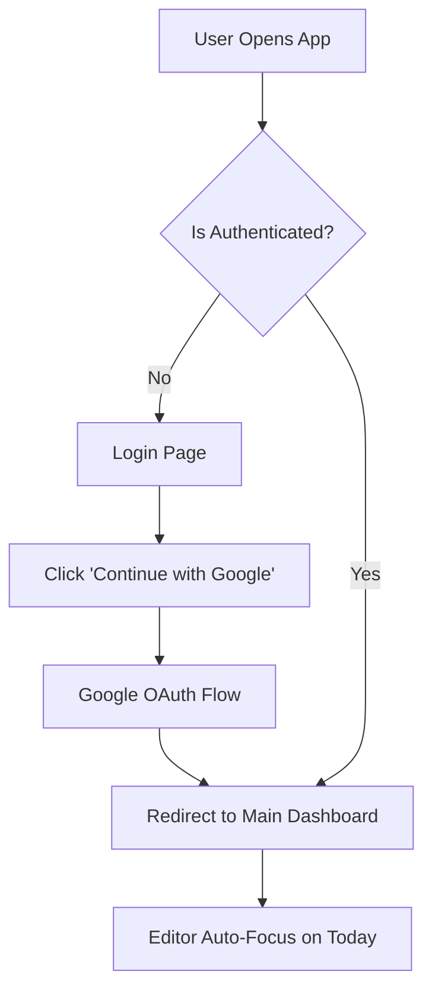
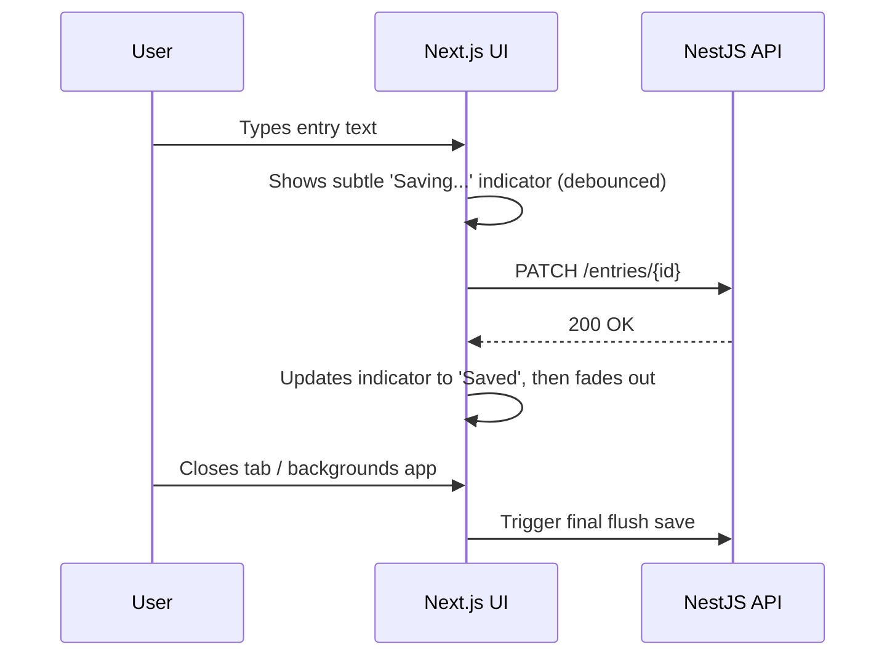

# Journ — UI Documentation

## 1. Overview and UX Principles

The UI of Journ is designed around a single core philosophy: **frictionless writing**. It is a private, digital notebook where the interface gets out of the way to let thoughts flow.

### Core Principles
- **Zero Friction**: The app opens straight into today's entry. No dashboards, no menus to navigate before typing.
- **Distraction-Free**: Minimal chrome. The editor is clean and uncluttered.
- **Speed**: Interactions must be immediate. Autosave is invisible and instantaneous; scrolling is natural and fast.
- **Supportive AI**: The AI is a passive, gentle companion. It never interrupts, nags, or alters the user's actual entries without explicit permission.

---

## 2. Pages and Views

### 2.1 Login Page
- **Purpose**: Authenticate the user via Google (the only login option).
- **Components**:
  - Minimalistic branding/logo centered on the screen.
  - A prominent "Continue with Google" OAuth button.
  - No complex onboarding, signup forms, or feature carousels.
- **Flow**: Upon successful login, the user is redirected immediately to the Main Dashboard (Today's Entry).

### 2.2 Main Dashboard (The Cake)
This is the heart of the application. It consists of the Editor at the top and the Timeline below it.

#### A. Header
- Minimalistic top bar.
- Subtle, quiet autosave indicator (e.g., "Saved" text that fades out).
- Small profile picture avatar in the corner to access Settings/Account.

#### B. The Editor (Today's Entry)
- **Auto-focus**: The text area is focused automatically upon app load. Keyboard opens instantly on mobile.
- **Soft Placeholder**: Instead of a blank void, a rotating, non-AI prompt appears (e.g., "What's on your mind today?").
- **Text Area**: Expands dynamically as the user types. Comfortable typography (readable font size, generous line height).
- **Attachments Strip**: A low-profile section below the text for attaching:
  - Voice clips (displays as an audio waveform/player).
  - Photos (displays as thumbnails).
  - Location (displays as a simple text label).
- **No Save Button**: Changes are debounced and saved automatically.

#### C. The Timeline (Past Entries)
- Chronological list of past entries, newest first.
- **Entry Cards**:
  - **Date Label**: Distinct styling for "Today", "Yesterday", and older dates.
  - **Summary**: A 1-line AI-generated gist for quick scanning.
  - **Preview**: A short snippet of the actual text.
  - **Media Indicators**: Small icons indicating the presence of voice, photo, or location attachments.
- **Interaction**: Tapping any card expands it into a seamless view/edit mode without navigating to a new page.

#### D. Floating Action Button (FAB)
- A persistent, floating button in the bottom corner to open the AI Chatbot companion.

### 2.3 AI Chatbot Interface
- **Purpose**: A conversational space to talk, vent, or think out loud, backed by journal context.
- **Components**:
  - **Header**: Close button to return to the Main Dashboard, and a toggle for Text/Voice modes.
  - **Transcript Area**: Standard chat bubbles for user and AI messages.
  - **Input Area**: Text field, Send button, and a hold-to-talk Voice button.
  - **Drafting UI (Context-Driven Journaling)**:
    - When the AI detects a meaningful moment (or when the user requests it), a **Draft Card** is presented inline.
    - The Draft Card shows the proposed journal text.
    - **Actions**: "Edit", "Save to Today's Entry", "Save as New Entry", "Discard".
    - **Constraint**: Nothing is saved without explicit user confirmation.

### 2.4 Settings / Account Sidebar (or Modal)
- **Purpose**: Account management.
- **Components**:
  - User Profile Info (Google Profile Picture, Name, Email).
  - **Logout Button**.
  - **Delete Account**: A destructive action requiring strict, explicit confirmation, explaining that all entries, attachments, and habit memory will be permanently wiped.

---

## 3. Functional Components

### 3.1 Media & Attachments
- **Photos**: Uploaded from camera or gallery. Displayed in a grid if multiple. Tapping a photo opens a fullscreen lightbox.
- **Voice**: Played via a minimal, inline audio player. Transcript is generated silently in the background (not shown in the primary UI).
- **Location**: Fetched via browser geolocation or manual entry. Displayed as a pill/tag.

### 3.2 Search Interface
- **Trigger**: Search icon in the header or timeline.
- **Input**: A standard search bar encouraging natural language questions (e.g., "when did I feel anxious about work").
- **Results**: Uses RAG (Vertex AI Vector Search) to display matching past entry cards.

---

## 4. User Flow Diagrams

### 4.1 Login & Onboarding Flow


### 4.2 Write & Autosave Flow


### 4.3 AI Chat & Context Save Flow
```mermaid
graph TD
    A[Tap Chat FAB] --> B[Open Chatbot Modal/Page]
    B --> C[AI greets with context-aware question]
    C --> D[User replies (text or voice)]
    D --> E[Conversation continues]
    E --> F{AI detects meaningful moment <br/> OR User says 'save this'}
    F -- Yes --> G[AI suggests Entry Draft inline]
    F -- No --> E
    G --> H[User reviews Draft Card]
    H --> I[Edit Draft]
    H --> J[Discard]
    H --> K[Save to Today]
    H --> L[Save as New Entry]
    I --> K
    I --> L
```

### 4.4 Read & Search Flow
```mermaid
graph TD
    A[Main Dashboard] --> B[Scroll Timeline chronologically]
    A --> C[Tap 'Search' icon]
    C --> D[Enter Natural Language Query]
    D --> E[AI + RAG fetches relevant entries]
    E --> F[Display search results (Entry Cards)]
    F --> G[Tap result to view full entry]
    B --> H[Tap past Entry Card]
    H --> G
```

---

## 5. UI Scopes & Constraints

- **Mobile-First**: The web app must feel native on mobile devices. No awkward zooming, fast touch targets (min 44x44px), and native-feeling scrolling.
- **Color Palette**: Highly restrained. Neutral backgrounds (white/off-white for light mode, deep gray for dark mode) to ensure the user's words are the visual priority. Accent colors used sparingly for primary actions (e.g., the Chat FAB).
- **Typography**: Sans-serif or Serif fonts optimized for long-form reading (e.g., Inter, system-ui, or a clean serif like Merriweather). Generous line height (e.g., `1.5` or `1.6`) and paragraph spacing.
- **Animations**: Must be subtle and fast (<200ms). No long, sweeping transitions that delay the user from writing. Expand/collapse animations on timeline entries should feel instantaneous.
- **Accessibility (a11y)**:
  - High contrast for text.
  - Screen-reader friendly, especially ensuring that background autosave states and chatbot updates are announced properly without being intrusive.
  - Keyboard navigation support for desktop users (e.g., `Esc` to close chat, `Enter` to send).
